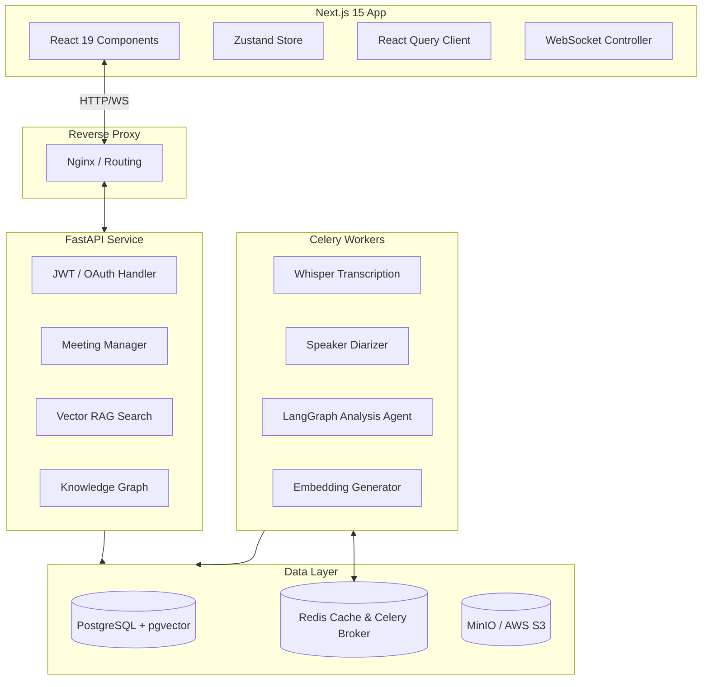
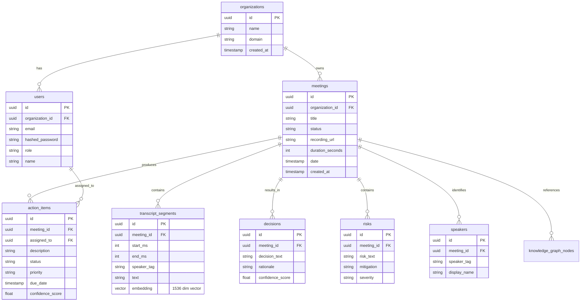

# MeetingMind AI - Product Requirements & Architecture Design Document

This document serves as the single source of truth for the architectural and product specifications of **MeetingMind AI**.

---

## 1. Product Requirements Document (PRD)

### 1.1. Core Value Proposition
MeetingMind AI is an **Organizational Memory Platform**. Traditional tools summarize a single meeting transcript in isolation. MeetingMind AI treats every meeting as an incremental update to a global organization knowledge base. It links conversations, files, code repositories, tasks, decisions, and people over time.

### 1.2. Key Features & Functional Requirements
1. **Multi-Tenant Account Management**: Organizations register and isolate their data. Users belong to organizations with role-based access control (RBAC).
2. **Audio/Video Ingestion**: Users upload files or record meetings live.
3. **Speech-to-Text & Diarization**: High-quality transcription with identified speaker segments.
4. **AI-Powered Meeting Insights**:
   - Executive & Detailed Summaries.
   - Decisons detection (with rationale & confidence scores).
   - Risks & blockers identification.
   - Action Items extraction (assigned owner, priority, deadline).
   - Technical context detection (repositories, databases, APIs, code snippets).
   - Interactive timelines.
   - Sentiment and conflict tracking.
5. **Organizational Memory (RAG)**: Global search and chat across all historical meetings.
6. **Knowledge Graph**: Visualize nodes (People, Projects, Technologies, Repositories, Meetings, Decisions, Tasks) and their links.
7. **Integrations**: Sync actions to Jira, link to GitHub PRs/issues, send notifications via Slack/Teams.

---

## 2. Software Architecture Document

### 2.1. High-Level Architecture Diagram

### 2.2. Technology Stack & Trade-Offs

| Layer | Technology | Rationale & Trade-Offs |
| :--- | :--- | :--- |
| **Frontend** | Next.js 15, React 19, TypeScript, TailwindCSS, Zustand | Next.js App Router provides optimal SSR and client rendering. Zustand is lightweight and highly performant compared to Redux. Tailwind allows for modular styling. |
| **Backend** | FastAPI, Python, SQLAlchemy, PostgreSQL | FastAPI provides high throughput, automatic OpenAPI generation, and native async support. Python allows seamless interaction with AI/ML tooling. |
| **Storage** | PostgreSQL + pgvector, Redis, MinIO | pgvector keeps our relational and vector data in one ACID-compliant database, eliminating the sync issues of dedicated vector stores (e.g. Pinecone). Redis is used as a fast key-value cache and a Celery broker. |
| **AI Layer** | LangGraph, Whisper, pgvector | LangGraph allows modeling agentic workflows as State Graphs (ideal for multi-step AI verification and feedback loops during extraction). |

---

## 3. Database Schema Design (ERD equivalent)

---

## 4. API Specifications (OpenAPI Highlight)

* **POST /api/v1/auth/register** & **POST /api/v1/auth/token**: User registration and JWT issuance.
* **POST /api/v1/meetings/upload**: Creates meeting record, uploads audio to S3/MinIO, triggers Celery processing chain.
* **GET /api/v1/meetings/{id}**: Retrieves meeting details, transcript segments, timeline, decisions, risks, action items, and integrations.
* **POST /api/v1/meetings/{id}/chat**: Chat with the meeting using RAG.
* **GET /api/v1/search/semantic**: Queries pgvector embeddings of transcripts to return relevant meetings, segments, or action items.
* **GET /api/v1/knowledge/graph**: Returns JSON representing nodes and edges (links between People, Meetings, Projects, Decisions, and Technologies).

---

## 5. Security & Isolation Policy

1. **Multi-Tenancy**: Every database table includes an `organization_id` column. Every API request parses the JWT payload to extract `organization_id`, and queries inject `WHERE organization_id = :org_id` dynamically to prevent cross-tenant leaks.
2. **File Storage**: Object storage uploads are protected via signed URLs generated by backend with a 15-minute expiration window.
3. **Role-Based Access Control (RBAC)**: Roles include `Admin`, `Member`, and `Observer`. Only admins can modify integrations, organization settings, and configure LLM provider settings.
4. **Data Protection**: PII masking is applied in the pipeline before sending transcripts to public LLMs. Prompt injection mitigations are embedded in the system prompts.
